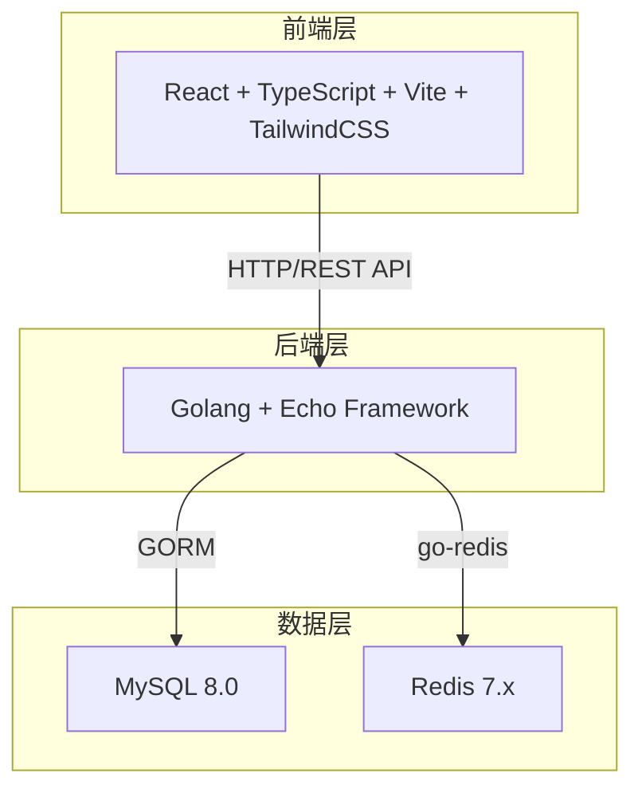
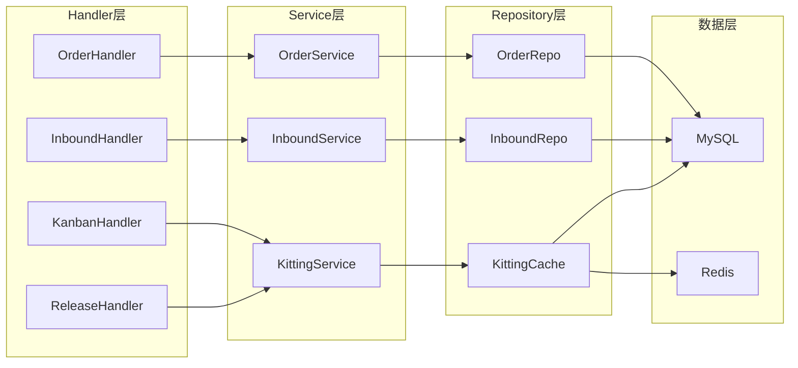
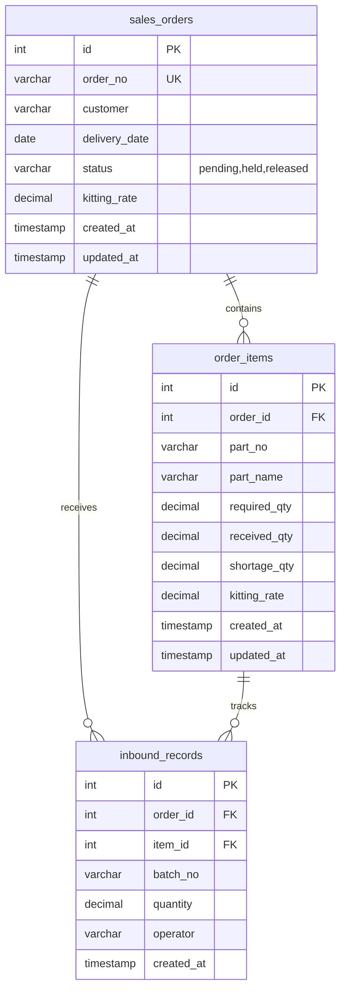

## 1. 架构设计



## 2. 技术说明

- 前端：React@18 + TypeScript + Vite + TailwindCSS@3 + Zustand + React Router + lucide-react
- 初始化工具：vite-init (react-ts模板)
- 后端：Golang 1.22+ + Echo v4 + GORM + go-redis/v9
- 数据库：MySQL 8.0 (localhost:3306, pwd:123456)
- 缓存：Redis 7.x (localhost:6379)
- 后端开启debug日志

## 3. 路由定义

| 路由 | 用途 |
|------|------|
| / | 重定向到 /orders |
| /orders | 订单管理-订单列表 |
| /orders/create | 新建销售订单 |
| /orders/:id | 订单详情(含齐套明细) |
| /inbound | 入库核对-入库录入 |
| /inbound/records | 入库记录查询 |
| /kanban | 齐套进度看板 |
| /kanban/shortages | 缺件汇总 |
| /release | 放行管理 |

## 4. API定义

### 4.1 订单管理

```typescript
// 创建销售订单
POST /api/orders
Request: {
  order_no: string
  customer: string
  delivery_date: string
  items: Array<{
    part_no: string
    part_name: string
    required_qty: number
  }>
}
Response: { id: number, order_no: string }

// 获取订单列表
GET /api/orders?page=1&page_size=20&status=&keyword=
Response: {
  total: number
  list: Array<{
    id: number
    order_no: string
    customer: string
    delivery_date: string
    status: string
    kitting_rate: number
    created_at: string
  }>
}

// 获取订单详情(含齐套明细)
GET /api/orders/:id
Response: {
  id: number
  order_no: string
  customer: string
  delivery_date: string
  status: string
  kitting_rate: number
  items: Array<{
    id: number
    part_no: string
    part_name: string
    required_qty: number
    received_qty: number
    shortage_qty: number
    kitting_rate: number
  }>
}

// 更新订单状态(放行/挂起)
PUT /api/orders/:id/status
Request: { status: "released" | "held" }
Response: { success: boolean }
```

### 4.2 入库核对

```typescript
// 创建入库记录
POST /api/inbound
Request: {
  order_id: number
  item_id: number
  batch_no: string
  quantity: number
  operator: string
}
Response: { id: number, kitting_rate: number }

// 获取入库记录
GET /api/inbound/records?page=1&page_size=20&order_id=&part_no=
Response: {
  total: number
  list: Array<{
    id: number
    order_no: string
    part_no: string
    part_name: string
    batch_no: string
    quantity: number
    operator: string
    created_at: string
  }>
}
```

### 4.3 齐套看板

```typescript
// 获取齐套看板数据
GET /api/kanban?status=&sort=kitting_rate
Response: Array<{
  id: number
  order_no: string
  customer: string
  kitting_rate: number
  total_items: number
  completed_items: number
  status: string
  delivery_date: string
}>

// 获取缺件汇总
GET /api/kanban/shortages
Response: Array<{
  order_no: string
  part_no: string
  part_name: string
  required_qty: number
  received_qty: number
  shortage_qty: number
}>
```

### 4.4 放行管理

```typescript
// 获取可放行/已挂起订单
GET /api/release?status=released|held
Response: Array<{
  id: number
  order_no: string
  customer: string
  kitting_rate: number
  status: string
  delivery_date: string
}>

// 批量放行
POST /api/release/batch
Request: { order_ids: number[], action: "release" | "hold" }
Response: { success: boolean }
```

## 5. 服务端架构图



## 6. 数据模型

### 6.1 数据模型定义



### 6.2 数据定义语言

```sql
CREATE DATABASE IF NOT EXISTS kitting_check DEFAULT CHARACTER SET utf8mb4 COLLATE utf8mb4_unicode_ci;

USE kitting_check;

CREATE TABLE sales_orders (
    id BIGINT UNSIGNED NOT NULL AUTO_INCREMENT,
    order_no VARCHAR(64) NOT NULL COMMENT '订单编号',
    customer VARCHAR(128) NOT NULL COMMENT '客户名称',
    delivery_date DATE NOT NULL COMMENT '交付日期',
    status VARCHAR(32) NOT NULL DEFAULT 'pending' COMMENT '状态: pending-待齐套, held-挂起, released-已放行',
    kitting_rate DECIMAL(5,2) NOT NULL DEFAULT 0.00 COMMENT '齐套率(%)',
    created_at DATETIME NOT NULL DEFAULT CURRENT_TIMESTAMP,
    updated_at DATETIME NOT NULL DEFAULT CURRENT_TIMESTAMP ON UPDATE CURRENT_TIMESTAMP,
    PRIMARY KEY (id),
    UNIQUE KEY uk_order_no (order_no),
    KEY idx_status (status),
    KEY idx_delivery_date (delivery_date)
) ENGINE=InnoDB DEFAULT CHARSET=utf8mb4 COLLATE=utf8mb4_unicode_ci COMMENT='销售订单表';

CREATE TABLE order_items (
    id BIGINT UNSIGNED NOT NULL AUTO_INCREMENT,
    order_id BIGINT UNSIGNED NOT NULL COMMENT '订单ID',
    part_no VARCHAR(64) NOT NULL COMMENT '料号',
    part_name VARCHAR(256) NOT NULL COMMENT '料号名称',
    required_qty DECIMAL(12,2) NOT NULL COMMENT '应入库数量',
    received_qty DECIMAL(12,2) NOT NULL DEFAULT 0.00 COMMENT '已入库数量',
    shortage_qty DECIMAL(12,2) NOT NULL DEFAULT 0.00 COMMENT '缺件数量',
    kitting_rate DECIMAL(5,2) NOT NULL DEFAULT 0.00 COMMENT '单项齐套率(%)',
    created_at DATETIME NOT NULL DEFAULT CURRENT_TIMESTAMP,
    updated_at DATETIME NOT NULL DEFAULT CURRENT_TIMESTAMP ON UPDATE CURRENT_TIMESTAMP,
    PRIMARY KEY (id),
    KEY idx_order_id (order_id),
    KEY idx_part_no (part_no),
    CONSTRAINT fk_item_order FOREIGN KEY (order_id) REFERENCES sales_orders(id) ON DELETE CASCADE
) ENGINE=InnoDB DEFAULT CHARSET=utf8mb4 COLLATE=utf8mb4_unicode_ci COMMENT='订单料号明细表';

CREATE TABLE inbound_records (
    id BIGINT UNSIGNED NOT NULL AUTO_INCREMENT,
    order_id BIGINT UNSIGNED NOT NULL COMMENT '订单ID',
    item_id BIGINT UNSIGNED NOT NULL COMMENT '订单明细ID',
    batch_no VARCHAR(64) NOT NULL COMMENT '批次号',
    quantity DECIMAL(12,2) NOT NULL COMMENT '入库数量',
    operator VARCHAR(64) NOT NULL COMMENT '操作人',
    created_at DATETIME NOT NULL DEFAULT CURRENT_TIMESTAMP,
    PRIMARY KEY (id),
    KEY idx_order_id (order_id),
    KEY idx_item_id (item_id),
    KEY idx_batch_no (batch_no),
    KEY idx_created_at (created_at),
    CONSTRAINT fk_record_order FOREIGN KEY (order_id) REFERENCES sales_orders(id),
    CONSTRAINT fk_record_item FOREIGN KEY (item_id) REFERENCES order_items(id)
) ENGINE=InnoDB DEFAULT CHARSET=utf8mb4 COLLATE=utf8mb4_unicode_ci COMMENT='入库记录表';

-- 初始示例数据
INSERT INTO sales_orders (order_no, customer, delivery_date, status, kitting_rate) VALUES
('SO-2026-001', '华为技术有限公司', '2026-07-15', 'pending', 0.00),
('SO-2026-002', '中兴通讯股份公司', '2026-07-20', 'pending', 0.00),
('SO-2026-003', '大疆创新科技公司', '2026-07-10', 'pending', 0.00);

INSERT INTO order_items (order_id, part_no, part_name, required_qty) VALUES
(1, 'FG-A1001', '主控板组件', 100.00),
(1, 'FG-A1002', '电源模块', 100.00),
(1, 'FG-A1003', '外壳组件', 200.00),
(1, 'FG-A1004', '连接线缆', 300.00),
(2, 'FG-B2001', '传感器模组', 50.00),
(2, 'FG-B2002', '信号处理器', 50.00),
(2, 'FG-B2003', '天线组件', 100.00),
(3, 'FG-C3001', '飞控主板', 30.00),
(3, 'FG-C3002', '云台组件', 30.00),
(3, 'FG-C3003', '电池包', 60.00),
(3, 'FG-C3004', '遥控器', 30.00),
(3, 'FG-C3005', '螺旋桨套装', 120.00);

INSERT INTO inbound_records (order_id, item_id, batch_no, quantity, operator) VALUES
(1, 1, 'B20260615-001', 60.00, '张三'),
(1, 2, 'B20260615-002', 100.00, '张三'),
(1, 3, 'B20260616-001', 150.00, '李四'),
(2, 5, 'B20260617-001', 50.00, '张三'),
(2, 6, 'B20260617-002', 30.00, '王五'),
(3, 9, 'B20260618-001', 60.00, '李四'),
(3, 10, 'B20260618-002', 30.00, '张三');

-- 更新已入库数量和齐套率
UPDATE order_items SET received_qty = 60.00, shortage_qty = 40.00, kitting_rate = 60.00 WHERE id = 1;
UPDATE order_items SET received_qty = 100.00, shortage_qty = 0.00, kitting_rate = 100.00 WHERE id = 2;
UPDATE order_items SET received_qty = 150.00, shortage_qty = 50.00, kitting_rate = 75.00 WHERE id = 3;
UPDATE order_items SET received_qty = 0.00, shortage_qty = 300.00, kitting_rate = 0.00 WHERE id = 4;
UPDATE order_items SET received_qty = 50.00, shortage_qty = 0.00, kitting_rate = 100.00 WHERE id = 5;
UPDATE order_items SET received_qty = 30.00, shortage_qty = 20.00, kitting_rate = 60.00 WHERE id = 6;
UPDATE order_items SET received_qty = 0.00, shortage_qty = 100.00, kitting_rate = 0.00 WHERE id = 7;
UPDATE order_items SET received_qty = 0.00, shortage_qty = 30.00, kitting_rate = 0.00 WHERE id = 8;
UPDATE order_items SET received_qty = 60.00, shortage_qty = 0.00, kitting_rate = 100.00 WHERE id = 9;
UPDATE order_items SET received_qty = 30.00, shortage_qty = 0.00, kitting_rate = 100.00 WHERE id = 10;
UPDATE order_items SET received_qty = 0.00, shortage_qty = 30.00, kitting_rate = 0.00 WHERE id = 11;
UPDATE order_items SET received_qty = 0.00, shortage_qty = 120.00, kitting_rate = 0.00 WHERE id = 12;

-- 更新订单齐套率
UPDATE sales_orders SET kitting_rate = 58.75 WHERE id = 1;
UPDATE sales_orders SET kitting_rate = 53.33 WHERE id = 2;
UPDATE sales_orders SET kitting_rate = 40.00 WHERE id = 3;
```
